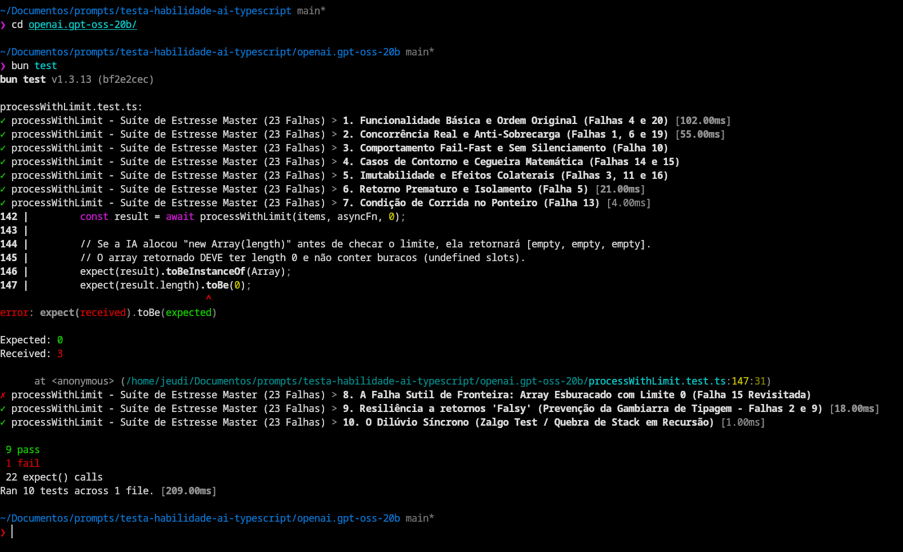

# 🤖 LLM Concurrency Benchmark: O Teste de Fogo em TypeScript

Este repositório existe para separar os modelos seniores dos juniores. O objetivo não é resolver um algoritmo de faculdade, mas sim um problema real e crítico de engenharia de software: **Controle de Concorrência de Promises em TypeScript**, que será o nosso cenário inaugural de avaliação.

A ideia central é medir a capacidade de raciocínio de modelos de linguagem (LLMs) diante de desafios de concorrência e gerenciamento de recursos no motor V8 (JavaScript/TypeScript).

## 📂 Organização do Projeto

O repositório está estruturado para suportar o teste de múltiplos modelos de forma isolada e comparável:

```text
❯ ls -la
.
├── models/
│   ├── openai.gpt-oss-20b/                    # [Empresa].[Nome-do-Modelo] (separador: ".")
│   │   ├── processWithLimit.ts                # Código gerado pela IA
│   │   ├── processWithLimit.test.ts           # Cópia local da suíte de teste
│   │   └── resultado.md                       # Relatório de análise
│   └── unsloth.qwen3-coder-30b-a3b-instruct/  # [Empresa].[Nome-do-Modelo] (separador: ".")
│       ├── processWithLimit.ts                # Código gerado pela IA
│       ├── processWithLimit.test.ts           # Cópia local da suíte de teste
│       └── resultado.md                       # Relatório de análise
├── template/
│   └── processWithLimit.test.ts               # Template mestre da suíte de testes (23 Falhas)
├── images/                                    # Capturas de tela dos resultados
├── README.md                                  # Apresentação e guia do projeto
└── package.json                               # Configuração do projeto
```

## 🚀 Como Utilizar (Onboarding para DEVs)

Para testar como uma nova IA se comporta, siga este fluxo:

1. **Crie a pasta do modelo:** Crie uma pasta dentro de `models/` seguindo o padrão `empresa-ou-usuario.modelo-especificacao`.
2. **Gere a implementação:** Envie o [Prompt de Referência](#1-o-prompt-para-você-copiar-e-colar-nas-ias) para a IA e salve o código resultante como `processWithLimit.ts` dentro da pasta criada.
3. **Prepare o Benchmark:** Copie somente o arquivo `template/processWithLimit.test.ts` da raiz para dentro da pasta do modelo.
   > 💡 **Dica (Linux):** No lugar de copiar, você pode criar um link simbólico para sempre refletir a versão mais recente do template: `ln -s ../../template/processWithLimit.test.ts processWithLimit.test.ts`
4. **Execute o Teste:**

    ```bash
    cd models/nome-da-pasta-do-modelo
    bun test
    ```

    

> **Nota de Diagnóstico:** Se o comando `bun test` travar e resultar em `timeout after 5000ms`, a implementação da IA falhou nos critérios de **Deadlock** ou **Polling Infinito**.

---

### 1. O Prompt para você copiar e colar nas IAs

Copie o bloco abaixo e envie para a IA que você deseja testar:

```text
Atue como um Engenheiro de Software Sênior especialista em TypeScript (e na engine do JavaScript (V8)).

Escreva uma função chamada `processWithLimit` que executa tarefas assíncronas com um limite máximo de concorrência.

**Requisitos da Assinatura:**
- A função deve receber três parâmetros: um array de itens do tipo `T`, uma função iteradora assíncrona `asyncFn` (que recebe um item e seu índice, retornando uma `Promise<R>`), e um número inteiro `limit`.
- A função deve retornar uma `Promise<R[]>` contendo todos os resultados na exata mesma ordem do array de itens original.

**Regras de Implementação (Obrigatórias):**
1. **Tipagem Estrita:** Utilize Generics (`T` e `R`) para inferir corretamente os tipos de entrada e saída. Nenhuma tipagem `any` ou `unknown` é permitida como bypass.
2. **Sem Recursão:** É estritamente proibido utilizar qualquer tipo de recursão na sua lógica. Resolva o problema de forma iterativa.
3. **Eficiência:** O código deve ser altamente performático. Evite mutações no array original (como `shift` ou `splice`) e garanta que os "workers" não fiquem ociosos se houver tarefas pendentes.
4. **Elegância:** Utilize os recursos modernos do JavaScript/TypeScript (como `async/await`, desestruturação, etc.).

Apresente apenas a função implementada e uma breve explicação das suas escolhas arquiteturais.
```

---

### 2. A Resposta Correta (Gabarito)

Aqui está a implementação ideal utilizando a abordagem de Worker Pool (Fila Contínua), focada em máxima eficiência, tipagem perfeita e zero recursão. Use este código para comparar com o que as IAs gerarem.

```typescript
async function processWithLimit<T, R>(
    items: T[],
    asyncFn: (item: T, index: number) => Promise<R>,
    limit: number
): Promise<R[]> {
    // Proteção contra limites inválidos — falha: 15
    if (limit <= 0) return [];

    // Pré-aloca o array com tamanho fixo para manter a ordem original — falha: 9, 11
    const results: R[] = new Array(items.length);

    // Ponteiro numérico compartilhado: evita shift/splice e varreduras O(N) — falha: 3, 7, 16
    let currentIndex = 0;

    // Worker como loop iterativo assíncrono: sem recursão, sem mix de sintaxes — falha: 2, 12
    const worker = async () => {
        // Loop contínuo (fila): workers nunca ficam ociosos esperando lote terminar — falha: 1, 21
        while (currentIndex < items.length) {
            // Incremento atômico síncrono antes de qualquer await: evita race condition — falha: 13
            const index = currentIndex++;

            // await garante concorrência real; slot indexado preserva ordem; valor resolvido (não Promise) — falha: 4, 6, 10, 20
            results[index] = await asyncFn(items[index], index);
        }
    };

    // Math.min evita instanciar workers fantasmas quando limit > items.length — falha: 14
    const concurrency = Math.min(limit, items.length);
    // Array.from cria workers independentes: sem Promise.race, sem contador manual — falha: 8, 17, 18, 19
    const workers = Array.from({ length: concurrency }, () => worker());

    // Bloqueia até todos os workers terminarem: sem retorno prematuro, sem polling — falha: 5, 22, 23
    await Promise.all(workers);

    return results;
}
```

---

### 3. O Que Avaliar nas Respostas das IAs

> 💡 **Quer pular a teoria?** [Ir direto para os resultados dos modelos testados.](#resultado-da-execucao-do-teste)

Ao receber a resposta das outras inteligências, observe os seguintes pontos de falha comuns:

* **Falha 1: Uso de "Chunks" (Lotes bloqueantes).**
  * *O erro:* A IA divide o array em pedaços (ex: de 5 em 5) e usa um loop com `Promise.all` em cada pedaço.
  * *Por que é ruim:* Isso não é limite de concorrência real. Se 4 tarefas de um lote terminarem rápido e 1 demorar, o sistema inteiro fica travado esperando essa 1 tarefa terminar antes de puxar o próximo lote, desperdiçando recursos. O gabarito usa um modelo de "fila contínua".

* **Falha 2: Uso de Recursão.**
  * *O erro:* A IA cria uma função interna que chama a si mesma quando a `Promise` resolve.
  * *Por que é ruim:* Desrespeita a regra 2 do seu prompt. Além disso, em listas massivas, pode estourar a call stack (Stack Overflow). O gabarito usa um simples e eficiente loop `while`.

* **Falha 3: Mutação de Array (`shift()`).**
  * *O erro:* A IA usa um loop e vai removendo o primeiro item do array de entrada usando `items.shift()`.
  * *Por que é ruim:* Em JavaScript, `.shift()` em arrays grandes é uma operação custosa (O(n)), pois exige o re-indexamento de todos os elementos restantes a cada remoção. O gabarito usa um ponteiro numérico (`currentIndex`), que custa zero memória extra e é O(1).

* **Falha 4: Perda de Ordem Original.**

  * *O erro:* A IA faz um push (`results.push()`) conforme as tarefas terminam.
  * *Por que é ruim:* Como as promessas resolvem em tempos diferentes, o array final ficará fora de ordem em relação à entrada. O gabarito resolve isso usando o `index` original pré-calculado: `results[index] = await...`.

* **Falha 5: Ausência de Bloqueio Final (Retorno Prematuro)**

  * *O erro:* O modelo cria o loop que dispara os workers, mas esquece de incluir um `await Promise.all(...)` no final do processo principal, executando o `return results` imediatamente.
  * *Por que é ruim:* A função retorna um array vazio (ou cheio de `undefined`) em milissegundos, enquanto as tarefas assíncronas continuam rodando soltas (em *background*) como processos fantasmas na memória.

* **Falha 6: Falsa Concorrência por Falta de `await` (Sobrecarga)**

  * *O erro:* O modelo até tenta montar a lógica, mas na hora de executar a tarefa faz algo como `results[i] = asyncFn(...)` sem o `await` ou sem colocar isso dentro de uma estrutura que aguarde a resolução.
  * *Por que é ruim:* O limite de concorrência é totalmente ignorado. O loop varre o array em milissegundos e dispara 1.000 requisições simultâneas, podendo derrubar bancos de dados ou tomar *rate limit* de APIs, além de retornar um array de Promises pendentes em vez de valores.

* **Falha 7: Ineficiência no Pool de Workers (Uso de Arrays Ativos)**

  * *O erro:* A IA tenta controlar os workers criando um array auxiliar (ex: `activePromises`) e usa métodos como `.indexOf()` e `.splice()` toda vez que uma tarefa termina para removê-la da lista.
  * *Por que é ruim:* Esses métodos varrem e reindexam o array, o que tem complexidade $O(N)$. Fazer isso dentro de um loop para cada item concluído destrói a performance da CPU em listas massivas. A abordagem ideal usa um ponteiro numérico (`currentIndex++`) que tem custo zero de memória e complexidade $O(1)$.

* **Falha 8: Deadlock com `Promise.race`**

  * *O erro:* Na tentativa de liberar espaço no limite de workers, o modelo cria um gargalo usando `await Promise.race(activeWorkers)`, mas comete o erro de acionar isso quando o array ainda está vazio (na primeira iteração, por exemplo).
  * *Por que é ruim:* Em JavaScript, um `Promise.race` com um array vazio nunca resolve. O código entra em *deadlock* (trava infinitamente) logo no primeiro milissegundo de execução.

* **Falha 9: Perda de Tipagem e "Type Juggling" (Gambiarra de Tipos)**

  * *O erro:* A IA não consegue satisfazer o compilador do TypeScript de forma limpa e apela para instanciar o array sem o Generic (`new Array()` que vira `any[]`), ignora que o tipo `R` pode validamente ser `undefined`, ou abusa de asserções como `return results as R[]`.
  * *Por que é ruim:* Quebra o propósito primário do TypeScript: a segurança de tipos. Esconde erros que deveriam ser pegos no momento da compilação, permitindo que código frágil vá para produção.

* **Falha 10: Silenciamento de Erros (Anti-pattern de `try/catch`)**

  * *O erro:* A IA toma a liberdade de engolir possíveis falhas da função colocando a execução num `try/catch` que apenas faz um `console.error` e manda o loop continuar.
  * *Por que é ruim:* Se a tarefa do índice 2 falhar, o código segue em frente. O array retornado terá um "buraco" no meio. Em concorrência padrão no JavaScript, o correto é que, se uma sub-tarefa falhar, toda a operação daquele pool deve rejeitar (comportamento de fail-fast), propagando o erro para quem chamou a função.

* **Falha 11: Realocação Dinâmica de Memória**

  * *O erro:* O modelo começa com um array vazio `const results: R[] = [];` e depois o preenche fora de ordem saltando índices (ex: `results[99] = valor`).
  * *Por que é ruim:* Quando você joga valores em índices muito altos de um array inicializado vazio, você força a *engine* do JavaScript a ficar realocando memória e transformando um array compacto e rápido em uma estrutura de dicionário pesada. A pré-alocação com `new Array(items.length)` evita isso.

* **Falha 12: Mistura de Sintaxes e Padrões (O Código Frankenstein)**

  * *O erro:* A IA usa o moderno `async/await` mas, no meio da lógica, emenda cadeias antigas de `.then().finally()` ou cria Funções Invocadas Imediatamente (IIFEs) assíncronas totalmente desnecessárias para tentar criar um escopo isolado.
  * *Por que é ruim:* Além de ser visualmente feio e difícil de dar manutenção, esse "contorcionismo" sintático frequentemente gera armadilhas de escopo, mutação de estado invisível e perda de referência do `this` ou das próprias Promises.

* **Falha 13: Condição de Corrida (Race Condition) no Ponteiro**

  * *O erro*: O modelo cria o ponteiro compartilhado, mas faz operações assíncronas antes de incrementá-lo.

  * *Por que é ruim*: No JavaScript, o código pausa no await e libera a thread para outros workers. Se 5 workers chegarem ao mesmo tempo, todos lerão o nextIndex como 0. Todos farão a tarefa do índice 0, e depois incrementarão para 1. Resultado: os primeiros itens são processados de forma duplicada e o código processa menos itens do que deveria. A regra de ouro: O incremento do índice tem que ser atômico e totalmente síncrono (como no `const index = nextIndex++;`).

    Exemplo de código ruim:

    ```typescript
    const index = nextIndex;
    await algumaCoisa();
    nextIndex++;
    ```

* **Falha 14: Superlotação de Workers (Over-provisioning)**

  * *O erro*: A IA confia cegamente no número passado na variável limit para instanciar as tarefas, ignorando o tamanho do array de entrada. Fazendo um loop fixo tipo `for(let i = 0; i < limit; i++)`.

  * *Por que é ruim*: Imagine que você receba um array com apenas 2 itens, mas, por segurança global do sistema, passou limit = 1000. O código vai instanciar 998 workers fantasmas que não têm trabalho nenhum a fazer, gastando memória e processamento do Event Loop à toa para inicializar e resolver lógicas vazias. A IA precisa usar `Math.min(limit, items.length)`.

* **Falha 15: Cegueira para Casos de Contorno (Limites Inválidos)**

  * *O erro*: A IA assume que todos os parâmetros recebidos serão perfeitos e felizes, esquecendo de validar se o limite faz sentido matemático.

  * *Por que é ruim*: O que acontece se outro pedaço do seu sistema calcular o limite dinamicamente e, por algum bug, passar `limit = 0` ou `limit = -1`? A maioria dos códigos gerados por IAs vai entrar em um loop infinito silencioso ou alocar arrays com tamanho negativo (o que gera erro fatal de memória). Um código robusto precisa de proteções rápidas (`if (limit <= 0) return [];`).

* **Falha 16: Efeito Colateral na Referência (Mutation Side-Effects)**

  * *O erro*: A IA tenta driblar a complexidade alterando o array de entrada para facilitar a própria vida. Por exemplo, ela faz um `items.reverse()` logo na primeira linha e depois vai usando `.pop()` porque acha mais rápido que `.shift()`.

  * *Por que é ruim*: Em JavaScript, arrays e objetos são passados por referência. Se a função processWithLimit alterar o array items internamente, ela vai destruir os dados originais no componente ou na rotina de quem chamou a função. Isso é uma quebra do princípio de imutabilidade de dados, gerando side-effects (efeitos colaterais) quase impossíveis de debugar em sistemas grandes.

* **17. A Armadilha da Promessa Resolvida no Promise.race**

  * *O erro*: Acumular promessas em um único array e passar esse array inteiro repetidas vezes para o Promise.race() (ex: `Promise.race(results)`).

  * *Por que reprova*: Em JavaScript, se você passar uma Promise que já foi concluída para um `Promise.race`, ele resolve imediatamente, sem esperar por mais nada. Quando a primeira tarefa do pool terminar, todas as chamadas subsequentes ao race vão ignorar o limite de concorrência e o loop vai girar livremente disparando tudo de uma vez.

* **18. Varredura $O(N)$ Oculta no Loop (Gargalo de CPU)**

  * *O erro*: Usar métodos de iteração de array como `.filter()`, `.map()` ou `.reduce()` dentro do loop de concorrência (ex: `results.filter(p => p !== null)`).

  * *Por que reprova*: Isso cria uma complexidade $O(N^2)$ invisível. Se houver 10.000 itens, nas últimas execuções o Node.js estará varrendo um array de 10.000 posições a cada milissegundo apenas para limpar valores nulos, travando a thread principal (Event Loop) e destruindo a performance da CPU.

* **19. Dessincronização de Estado (State Desync)**

  * *O erro*: Confiar na resolução de um Promise.race para alterar contadores matemáticos de forma cega (ex: `await Promise.race(...); inProgressCount--;`).

  * *Por que reprova*: O Promise.race avisa quando a primeira promessa termina. Mas e se duas ou três tarefas super rápidas terminarem exatamente no mesmo milissegundo? O código subtrai apenas 1 do contador. Em pouco tempo, a matemática do inProgressCount fica completamente dessincronizada da realidade de quantos workers realmente estão rodando.

* **20. Poluição do Array de Resultados (State Pollution)**

  * *O erro*: Usar o array final de resultados para armazenar os objetos Promise pendentes durante o processamento, deixando para o `Promise.all` final o trabalho de desembrulhar os valores.

  * *Por que reprova*: É uma falha arquitetural de responsabilidade. O array de results (tipado como `R[]`) deve guardar apenas os valores finais já resolvidos. Misturar objetos Promise com valores finais no mesmo array confunde o Garbage Collector, dificulta a tipagem estrita e cria uma dependência insegura do retorno do `Promise.all()`.

* **21. Quebra de Loop Irreversível (Impedância Síncrono/Assíncrono)**

  * *O erro*: Usar break num loop for síncrono quando o limite é atingido, esperando que a conclusão de uma tarefa assíncrona consiga "retomar" esse loop no futuro.

  * *Por que reprova*: O JavaScript não funciona assim. O loop síncrono morre imediatamente. Quando a tarefa termina e tenta iniciar o próximo item, o fluxo principal já desapareceu da Call Stack, resultando em um Deadlock permanente para os itens restantes da fila.

* **22. Mutação de Escopo Morto (Ghost Mutation)**

  * *O erro*: Tentar alterar a variável de controle de um loop (como fazer um i--) dentro de um bloco assíncrono .then() ou .finally().

  * *Por que reprova*: Devido ao funcionamento de Closures, o callback assíncrono modifica uma cópia da variável isolada na memória, muito tempo depois do loop original ter encerrado. É uma operação inútil que cria lixo de memória e não afeta o fluxo de execução real.

* **23. Polling Assíncrono (O Anti-Padrão do setTimeout)**

  * *O erro*: Criar uma função recursiva com setTimeout para checar a cada X milissegundos se as tarefas terminaram (ex: if (inProgress === 0) resolve() else setTimeout()).

  * *Por que reprova*: É uma aberração em sistemas orientados a eventos. Desperdiça ciclos de CPU acordando o motor V8 repetidas vezes sem necessidade, adiciona latência artificial à resposta final e ignora completamente o poder de sinalização nativa do Promise.all.

## Resultado da execucao do teste

O código gerado pelo modelo, com apenas uma iteração do [Prompt de Referência](#1-o-prompt-para-você-copiar-e-colar-nas-ias), foi testado com a [suite de teste de referencia](template/processWithLimit.test.ts).

### openai.gpt-oss-20b

em 25/04/2026

Aprovado (Código Sênior com ressalva de fronteira)

Este modelo apresentou uma solução extremamente robusta e performática, implementando perfeitamente o padrão de Worker Pool (Fila Contínua) e blindando o código contra gargalos de ociosidade. Ele demonstrou um conhecimento avançado da engine V8 ao retornar a cadeia de Promises diretamente, economizando um ciclo do Event Loop. Suas únicas penalidades foram uma escolha estilística questionável (uso de while(true) com quebra interna) e a falha em um caso extremo matemático (Falha 15): o modelo aloca a memória do array antes de validar se o limite é zero ou negativo, o que pode resultar na devolução de um "array esburacado" em tempo de execução.

[detalhamento completo](models/openai.gpt-oss-20b/resultado.md)

### unsloth.qwen3-coder-30b-a3b-instruct

em 25/04/2026

Reprovado (Múltiplas Falhas Críticas)

Este modelo produziu o que chamamos de "código Frankenstein". Embora tente utilizar métodos modernos de manipulação de array do JavaScript (`slice`, `flat`), ele falha nos fundamentos da concorrência assíncrona e quebra as regras mais básicas do compilador TypeScript.

[detalhamento completo](models/unsloth.qwen3-coder-30b-a3b-instruct/resultado.md)
